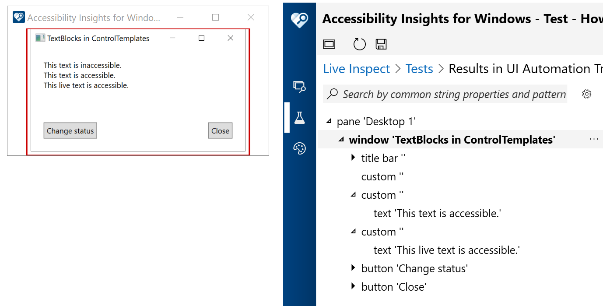
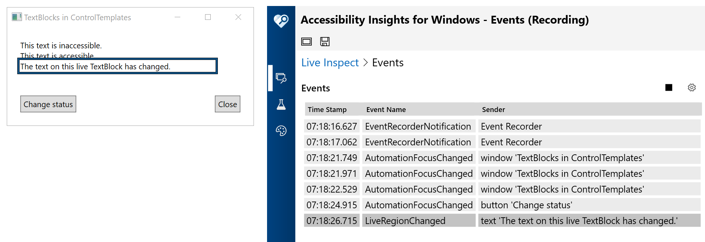

**_Barker's Disclaimer_:** I sometimes get stuff wrong. A WPF expert once told a bunch of people that one of my suggestions around accessibility was "especially bad". So please treat everything I say as suspect. But hopefully some of what I say below might be right, at least at the time of writing this, (27th March 2021).

The Windows accessibility API is called UI Automation, (UIA). Assistive Technologies such as screen readers use UIA to access information in apps for your customers. A while back I wrote an introduction into UIA, starting at [UI Automation: An Incomplete Guide for UI builders – Part 1](https://www.linkedin.com/pulse/ui-automation-incomplete-guide-builders-part-1-guy-barker). All important text shown in your app must be accessible to all your customers, and as such, the text must be exposed through the Control view of the UIA hierarchy.

Depending on how you implement your text, the text may or may not be exposed through the Control view of the UIA hierarchy by default. For example, a standard WPF TextBlock's Text will get exposed through that UIA view by default. Text shown in a template however, may not be exposed by default through the Control view of the UIA tree, depending on the type of template used and the version of .NET on which the app is built. At the time of writing this, text in a TextBlock contained in a ControlTemplate is not exposed through the Control view of the UIA tree. So if that text is important, (and typically it is otherwise it wouldn't be shown visually in the app), then some action must be taken by you to get the text exposed to all your customers.

Perhaps one option might be to reconsider the use of a ControlTemplate to present the text. Some information around ControlTemplates and DataTemplates are at [ControlTemplate Class](https://docs.microsoft.com/dotnet/api/system.windows.controls.controltemplate) and [Data Templating Overview](https://docs.microsoft.com/dotnet/desktop/wpf/data/data-templating-overview) respectively. But let's say you're sticking with use of ControlTemplates, and so you must take specific action to have the contained text exposed through the Control view of the UIA tree. One potential option might be to replace the use of a TextBlock inside the ControlTemplate with a ContentPresenter whose Content property is the text of interest. That change alone might be sufficient to make the text accessible. But let's say the text can change as the state of the app changes, and your customers need the updated text to be announced whenever the text changes. In that case, one option would be to have the text be what's known in the UI business as a "live region". Since .NET Framework 4.7.1, WPF has supported live regions, but I've not been able to get live regions to work with ContentPresenters, so one approach might be to have the text be presented in a custom TextBlock-derived class which forces the text to be exposed through the Control view of the UIA tree.

This tiny app demonstrates both these things. First it presents a standard TextBlock in a ControlTemplate, and that text is inaccessible. It then presents text using a ContentPresenter in a ControlTemplate, and that text is accessible. Finally it presents text in a ControlTemplate using a TextBlock-derived class which forces the text to be exposed through the Control view of the UIA tree. The app also shows a button which when invoked, changes that 3rd text string, and raises a UIA event to make screen readers aware of the change. Point the Narrator screen reader at the app and experience both the inaccessibility and accessiblity of the text yourselves.

By the way, Narrator can move to accessible static text in an app using its "Scan mode" or "Item navigation" functionality. For an introduction into Narrator, please visit:

* [Narrator – At a Glance](https://youtu.be/c0yDNQYRzRY)
* [Narrator gets more accessible with QuickStart](https://www.youtube.com/watch?v=FVj0cfn2ugg)
* [Accessibility Learning Webinar Series: Narrator 101]( https://www.youtube.com/watch?v=Uhya4f2miJ0)
* [Complete guide to Narrator](https://support.microsoft.com/en-us/help/22798/windows-10-complete-guide-to-narrator)

The following image shows the Accessibility Insights for Windows tool reporting the UIA hierachy of the demo WPF app. One of the three text strings shown visually in the app is not shown in the UIA representation of the UI.

The following image shows the Accessibility Insights for Windows tool reporting a UIA LiveRegionChanged event being raised by the demo WPF app. The updated text on the element raising the event is "The text on this live TextBlock has changed."

For my own take on the Accessibility Insights for Windows tool, please visit [How Accessibility Insights can help you and your customers](https://www.linkedin.com/pulse/how-accessibility-insights-can-help-you-your-customers-guy-barker/).

